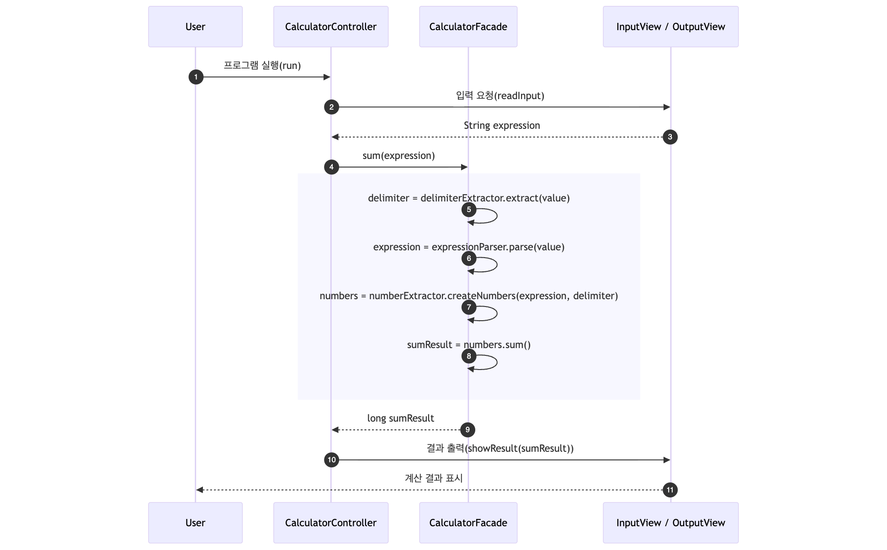

# java-calculator-precourse

## ▶️️ 흐름

1. 구분자 & 양수로 된 문자열을 입력한다.
2. 구분자를 기준으로 분리한 숫자들을 모두 더한다.
3. 덧셈 결과를 반환한다.
   

---

## 📝️ 기능 목록

### ▪️ 입력 기능

- [x] 구분자와 양수로 구성된 문자열 입력
    - [x] 입력값이 비었다면 `0` 반환

### ▪️ 비지니스 기능

- 문자열로부터 커스텀 구분자 추출하기
    - [x] 문자열 앞부분의 `//`와 `\n` 사이의 문자를 커스텀 구분자로 지정
        - [x] 커스텀 문자열 형식을 따르지 않은 경우 빈 문자열 반환
    - [x] 예외🚨: 구분자가 `숫자`면 예외 메세지 반환 후 종료
        ```
        예시 : //0\\n908070
        ```
    - [x] 예외🚨: 구분자가 문자가 아니면 예외 메세지 반환 후 종료
      ```
      예시 : //@@\\n9@@8@@7
      ```
    - [x] 예외🚨: 구분자가 `빈 문자열`이면 예외 메세지 반환 후 종료
        ```
        예시 : // \\n9 8 7
        ``` 
        ```
        예시 : //   \\n10   8   6
        ```

- 문자열 파싱하기
    - [x] 문자열에 커스텀 구분자 형식이 포함되어 있다면 형식 제거하기

- 문자열로부터 숫자 추출하기
    - [x] 구분자를 기준으로 숫자 추출하기
    - [x] 예외🚨: 음수, 0, 실수가 포함되어 있으면 예외 메세지 반환 후 종료
        ```
        예시 : //+\\n-1+0+1
        ```
        ```
        예시 : 1.5:8:6
        ```
    - [x] 예외🚨: `,`, `:`, `커스텀 구분자` 외의 문자열이 포함되어 있으면 예외 메세지 반환 후 종료
        ```
        예시 : /.\\n9 8 7
        ```
        ```
        예시 : //*\\10*8*6
        ```
        ```
        예시 : 1.2.3.4
        ```

    - [x] 예외🚨: 숫자없이 구분자만 존재한다면 예외 메세지 반환 후 종료
        ```
        예시 : ,::,
        ```

- 계산하기
    - [x] 모든 숫자 덧셈 하기
    - [x] 예외🚨: 합이 범위를 넘는 경우 예외 메세지 반환 후 종료
        ```
        예시 : 9223372036854775807:1
        ```

### ▪️ 출력 기능

- [x] 덧셈 결과 출력
    - [x] 구분자를 기준으로 분리한 각 숫자의 합 반환

---

## 📌 실행 결과 예시

```text
덧셈할 문자열을 입력해 주세요.
1,2:3
결과 : 6
```

```text
덧셈할 문자열을 입력해 주세요.
//*\n100*200*300
결과 : 600
```

---

## 📦 패키지 구조

| Package       | Class                  | Description                                  |
|:--------------|:-----------------------|:---------------------------------------------|
| ▶️ root       | `Application`          | 프로그램의 진입점(Main 클래스)                          |
| 🕹 controller | `CalculatorController` | 계산기 프로그램의 흐름을 제어하는 컨트롤러 클래스                  |
| 🧩 facade     | `CalculatorFacade`     | 전체 계산 과정을 캡슐화하여 외부에서 쉽게 사용할 수 있도록 하는 퍼사드 클래스 |
| 💾 domain     | `Delimiter`            | 구분자 정보를 저장하는 클래스                             |
|               | `DelimiterExtractor`   | 입력 문자열에서 구분자를 추출하는 클래스                       |
|               | `ExpressionParser`     | 입력된 문자열에서 표현식을 파싱하는 클래스                      |
|               | `NumberExtractor`      | 표현식에서 숫자만 추출하는 클래스                           |
|               | `Numbers`              | 추출된 숫자들의 집합을 표현하고, 합산 연산을 수행하는 클래스           |
| 💬 view       | `InputView`            | 사용자 입력을 처리하는 클래스                             |
|               | `OutputView`           | 계산 결과를 출력하는 클래스                              |

```text
calculator
├── Application.java
├── controller
│   └── CalculatorController.java
├── domain
│   ├── Delimiter.java
│   ├── DelimiterExtractor.java
│   ├── ExpressionParser.java
│   ├── NumberExtractor.java
│   └── Numbers.java
├── facade
│   └── CalculatorFacade.java
└── view
    ├── InputView.java
    └── OutputView.java
```

---

## 💡 구현 시 고민했던 부분들

### 1. 커밋 스코프는 필요할까? 필요하다면 범위를 어떻게 표현해야 할까?

`AngularJS Commit Conventions`에 의하면 커밋 스코프(scope)는 커밋이 영향을 미치는 코드의 영역을 명사 형태로 표현하는 것을 의미합니다.
스코프는 생략 가능하지만, 사용한다면 커밋 변경 내역을 나타낼 수 있는 어떤 단어든 될 수 있습니다.
> Scope could be anything specifying place of the commit change. For example $location, $browser, $compile, $rootScope,
> ngHref, ngClick, ngView, etc...

스코프를 “어떤 부분이 바뀌었는가를 간결하게 표현하는 단위”라고 생각했습니다.
따라서 이 단위가 너무 세밀하면, 나중에 관리가 어려워질 수 있다고 느꼈습니다.

예를 들어 클래스명이나 함수명을 스코프로 사용하면, 리팩터링 과정에서 이름이 바뀌었다면
과거 커밋 히스토리를 봐도 “이 클래스가 지금의 어떤 코드였더라?” 하며 맥락이 끊길 수 있을 것 같았습니다.
세부적인 변경 내용은 subject나 body에 기술할 수 있으므로,
스코프는 너무 구체적이기보다 model, view, controller와 같이 계층 단위로 표현하는 게 더 낫다고 판단했습니다.

이런 단위는 리팩터링이 일어나도 의미가 변하지 않고,
커밋 히스토리를 봤을 때도 “아, 이건 모델 쪽 수정이구나”처럼 한눈에 파악하기 좋았습니다.

### 2. 기능 목록은 어떤 기준으로 무엇을 고려해야 할까?

기능 목록을 작성할 때 프로그램을 실제로 사용할 클라이언트를 주요 대상으로 두고 작성했습니다.
프로그램을 처음 접하는 사람이 “프로그램이 어떤 일을 하는지”를 한눈에 이해할 수 있도록 하는 데 초점을 맞췄습니다.

이를 위해 기능을 `입력(Input) / 비즈니스 로직(Business) / 출력(Output)` 단위로 구분해 작성했습니다.
프로그램의 흐름을 반영함으로써, 프로그램이 어떤 순서로 동작하는지를 자연스럽게 파악할 수 있도록 했습니다.
또한 코드 세부 구현이 아닌 비즈니스 기능 단위로 기술함으로써, 리팩터링이나 구조 변경에도 기능 목록의 의미가 변하지 않도록 추상화했습니다.

이렇게 정리해 보니, 프로그램 전체의 논리적 구조와 책임 분리가 더 명확하게 드러난다는 점이 인상적이었습니다.
또한 처음 보는 사람뿐만 아니라 개발자 본인에게도 유지보수나 기능 추가 시 도움이 되는 문서라고 느낄 수 있었습니다.

### 3. 덧셈 범위를 `BigInteger`까지 고려해야 할까?

구현을 진행하면서 `BigInteger`를 사용할지에 대한 고민이 있었습니다.
`BigInteger`는 이론적으로 오버플로우가 발생하지 않아 안정성이 높지만, 연산 속도가 느리고 메모리 사용량이 많다는 단점이 있습니다.

이 프로그램은 일상생활에서 사용하는 단순한 사칙연산 중심의 계산기를 목표로 했습니다.
즉, 금융·통계·과학 계산처럼 정밀도가 중요한 분야가 아니라, 아이폰 기본 계산기처럼 가볍고 직관적인 계산 도구를 지향했습니다.

따라서 무제한 크기 정수를 다루는 `BigInteger`까지 고려하는 것은 프로그램의 목적에 비해 과도하다고 판단했기에,
`long` 범위 내에서 오버플로우를 감지하고 예외를 처리하는 방식을 선택했습니다.

기술 선택에 있어 절대적인 기준이 존재하는 것이 아니라, “무엇을 만들고자 하는가”에 따라 달라진다는 사실을 실감했습니다.
즉, 더 안전한 방법이 반드시 더 좋은 방법은 아니며, 프로그램의 목적에 맞게 선택하는 것이 중요하다는 점을 배웠습니다.

### 4. 퍼사드 패턴? 왜 도입했는데?

구현을 진행하면서 "퍼사드 패턴을 적용해야겠다”라는 의도는 없었습니다.
『객체지향의 사실과 오해』를 읽고 책임 중심 설계를 하다 보니, 구분자 추출·표현식 파싱·숫자 추출기 같은 객체들이 생겼고,
이들을 협력시키기 위한 조립자 역할로 클래스를 만들었습니다.

나중에 보니 이 구조가 복잡한 비지니스 로직을 하나의 진입점으로 단순화하는 퍼사드 패턴의 형태였기에,
`CalculatorFacade`라는 이름을 부여했습니다.
이로 인해 컨트롤러는 오직 프로그램 흐름만 담당하게 되었고, 입출력과 분리된 퍼사드 클래스를 통해 통합 테스트를 손쉽게 수행할 수 있었습니다.

의도하지 않았지만 책임 중심 설계 과정에서 자연스럽게 퍼사드 패턴이 도입된 점이 흥미로운 경험이었습니다.

### 5. 정규식 생성 책임, 왜 분리하지 않았나?

처음에는 숫자를 추출하는 클래스인 `NumberExtractor`가 많은 일을 하고 있는 것 같아,
정규식 생성 로직을 별도 클래스로 분리하는 방안을 고민했습니다.

하지만 실제로 분리하려고 할 때마다 “과도한 책임 분리 아닌가?”라는 의문이 들었습니다.
숫자 분리 시 사용하는 정규식이 `expression.split(regex)`를 이용하여 숫자 추출하는 과정과 밀접하게 결합되어 있기 때문입니다.
정규식 생성 로직을 별도 클래스로 분리해버리면 `NumberExtractor`는 동작을 위해 또 다른 객체를 의존해야 하고,
그 결과, 응집도는 낮아지고 결합도는 높아질 위험이 있다고 판단했습니다.

이번 고민을 통해 클래스를 무조건 나누기보다,
책임들이 서로 밀접하게 연관되어 있다면 응집도를 유지하는 편이 오히려 코드를 읽고 이해하기 좋다고 느낄 수 있었습니다.
